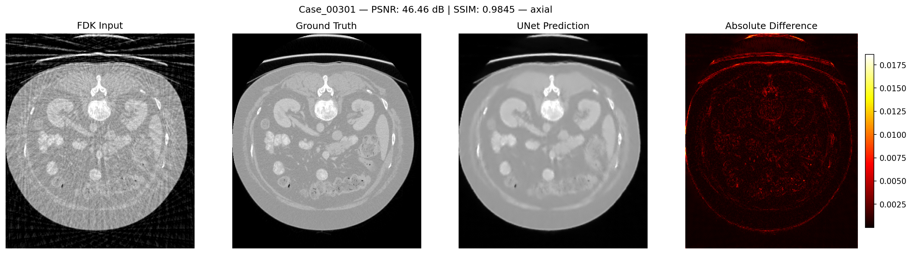

# Sparse-View Cone-Beam CT Reconstruction via a Dual-Domain Cascaded Network

> **Final Year Project (FYP)** — Nanyang Technological University (NTU),
> in collaboration with the Agency for Science, Technology and Research (A\*STAR).

This repository implements an end-to-end deep-learning pipeline for
**sparse-view cone-beam computed tomography (CBCT) reconstruction**. Given a
severely under-sampled set of X-ray projections, the proposed
**Dual-Domain Cascaded Network (CNCT)** jointly exploits sinogram-domain and
image-domain representations, bridged by a **differentiable backprojection
(DBP)** operator, to recover high-fidelity volumetric reconstructions from as
few as 60 views.

Sparse-view CT is a problem of direct relevance to two communities:

- **Medical imaging**, where reducing the number of X-ray projections linearly
  reduces the radiation dose delivered to the patient — a key objective of the
  ALARA (As Low As Reasonably Achievable) principle.
- **Semiconductor inspection and industrial metrology**, where shortening the
  acquisition time per sample enables higher throughput non-destructive
  testing (NDT) of integrated circuits, advanced packaging, and 3D NAND
  devices without compromising defect detectability.

Classical analytical reconstruction algorithms such as **FDK** produce severe
streak artifacts and noise amplification under sparse-view geometry. CNCT
addresses this by learning an artifact-removal prior that is *physically
consistent* with the acquisition geometry, thanks to an exact adjoint
backprojection layer differentiable under PyTorch autograd.

---

## Key Features

- **Dual-domain learning.** A sinogram-domain 3D U-Net (Branch A) and a
  volume-domain Residual U-Net (Branch B) are cascaded through a
  differentiable backprojection bridge, allowing joint optimisation over both
  the measurement and image domains in a single end-to-end loop.
- **Physically-exact DBP bridge.** A custom `torch.autograd.Function` wraps
  TIGRE's matched backprojector; the backward pass uses the forward projector
  `Ax` as the mathematically exact adjoint, so gradients flow through the
  acquisition geometry without surrogate approximations.
- **High-fidelity reconstruction.** A hybrid `L1 + SSIM + Sobel-edge` loss
  preserves both low-frequency HU accuracy and high-frequency edge structure
  critical for downstream diagnosis / defect detection.
- **Memory-efficient full-volume training.** Mixed-precision (AMP) +
  gradient checkpointing + on-demand CUDA cache clearing around each TIGRE
  call enable training on full-resolution cone-beam volumes on a single
  48 GB GPU.
- **HPC-ready I/O.** A fork-safe memory-mapped dataset supports
  `DataLoader(num_workers > 0)` on SLURM nodes without file-handle leaks.
- **Modular two-package design.** The TIGRE-heavy data-preparation stage is
  shipped as a standalone package (`cnct_dataprep`, no PyTorch dependency)
  so sinogram generation and FDK reconstruction can run on lighter nodes.
- **Bit-exact reproducibility.** Under `cudnn.deterministic = True` the
  refactored model matches the legacy implementation bit-for-bit on both
  forward and backward passes, including through the TIGRE DBP layer.
- **Custom-dataset ready.** Per-case TIGRE geometry is rebuilt from the
  NIfTI header, so volumes with heterogeneous voxel spacing and Z-depth can
  be used without manual intervention.

---

## Methodology Overview

The CNCT forward pipeline, for a sparse-view sinogram $s \in \mathbb{R}^{N_\theta \times N_r \times N_c}$ and its analytical FDK reconstruction $x_\text{fdk} \in \mathbb{R}^{Z \times Y \times X}$:

$$
\begin{aligned}
f_s &= \mathcal{U}_\text{sino}(s) && \text{(Branch A: sinogram features)} \\
f_v &= \mathcal{A}^{\top}(f_s) && \text{(Differentiable backprojection)} \\
\hat{r} &= \mathcal{U}_\text{vol}\!\left([\,x_\text{fdk}\ \|\ f_v\,]\right) && \text{(Branch B: artifact prediction)} \\
\hat{x} &= x_\text{fdk} - \hat{r} && \text{(Residual connection)}
\end{aligned}
$$

where $\mathcal{A}^\top$ denotes the matched (unfiltered) cone-beam
backprojector provided by TIGRE, whose adjoint — exact to floating-point
precision — is the forward projector $\mathcal{A} = A_x$.

The training objective is a hybrid loss:

$$
\mathcal{L} = \alpha \cdot \mathcal{L}_{1}(\hat{x}, x_\text{gt}) + \beta \cdot \bigl(1 - \text{SSIM}(\hat{x}, x_\text{gt})\bigr) + \gamma \cdot \mathcal{L}_{1}\!\left(\nabla \hat{x}, \nabla x_\text{gt}\right)
$$

with default weights $\alpha = 1.0$, $\beta = 0.2$, $\gamma = 1.0$.

---

## Project Structure

The repository is split into **two independent Python packages**:
`cnct_dataprep` (TIGRE, no PyTorch) handles projection and classical
reconstruction, and `cnct` (PyTorch + TIGRE) handles the deep-learning stage.

```
CNCT/
├── data_prep/                       # Package 1: cnct_dataprep (TIGRE only)
│   ├── configs/
│   │   ├── geometry.yaml            # shared cone-beam geometry
│   │   ├── projection.yaml          # forward-projection stage
│   │   ├── fdk.yaml                 # FDK reconstruction stage
│   │   └── evaluation.yaml          # PSNR / SSIM evaluation stage
│   └── src/cnct_dataprep/
│       ├── geometry/                # HU↔mu conversion + per-case geometry
│       ├── projection/              # tigre.Ax forward projection
│       ├── reconstruction/          # tigre.algorithms.fdk
│       ├── evaluation/              # metrics + visualisation
│       └── cli/                     # projection / fdk / evaluation CLIs
│
├── src/cnct/                        # Package 2: cnct (PyTorch + TIGRE)
│   ├── data/
│   │   ├── normalization.py         # pure-fn mu↔[-1,1] & sinogram scaling
│   │   ├── dataset.py               # DualDomainDataset (fork-safe mmap I/O)
│   │   └── prepare.py               # HDF5 split builder (80/10/10)
│   ├── models/
│   │   ├── blocks.py                # ConvBlock / Encoder / Bottleneck / Decoder
│   │   ├── unet3d.py                # ResidualUNet3D (single-domain baseline)
│   │   └── dual_domain.py           # SinogramUNet3D + DBP + VolumeUNet3D
│   ├── training/                    # Trainer, hybrid loss, metrics, ckpts
│   ├── inference/                   # Predictor
│   └── cli/                         # train / predict / prepare-data CLIs
│
├── configs/                         # cnct YAML configs
│   ├── geometry.yaml
│   ├── training.yaml
│   └── inference.yaml
│
├── slurm/                           # SLURM job templates
│   ├── data_prep/sbatch_dataprep.sh
│   └── dual_domain/
│       ├── sbatch_train.sh
│       └── sbatch_predict.sh
│
├── pyproject.toml                   # cnct package manifest
├── README.md                        # this file
└── CLAUDE.md                        # developer notes (architecture + gotchas)
```

### Data flow

```
NIfTI (HU) ──▶ cnct_dataprep.projection     ──▶ projections.npy
           ──▶ cnct_dataprep.reconstruction ──▶ recon_fdk.npy
           ──▶ cnct.data.prepare            ──▶ h5_3dunet/{train,val,test}/*.h5
                                                        │
                                                        ▼
                                               cnct.training.Trainer
                                                        │
                                                        ▼
                                              best_checkpoint.pytorch
                                                        │
                                                        ▼
                                              cnct.inference.Predictor
                                                        │
                                                        ▼
                                               <case>_recon.npy
                                                        │
                                                        ▼
                                          cnct_dataprep.evaluation (PSNR/SSIM)
```

---

## Environment Setup

### 1. Prerequisites

| Component | Version |
|---|---|
| OS          | Linux (tested on HPC SLURM cluster) |
| Python      | ≥ 3.10 |
| CUDA toolkit| **12.3** (the SLURM scripts load `CUDA/12.3.0`) |
| GPU         | ≥ 24 GB recommended; 48 GB for full-volume training |
| TIGRE       | Built from source against the target GPU architecture |
| PyTorch     | ≥ 2.1 with CUDA 12.x wheels |

> **CUDA compatibility note.** TIGRE kernels must be compiled against the
> compute capability of the target GPU. Mixing a Blackwell GPU
> (RTX PRO 6000, `sm_120`) with a CUDA 12.3 build of TIGRE causes silent
> zero-output failures (`Ax:Siddon_projection no kernel image is available
> for execution on the device`). See `CLAUDE.md` for details.

### 2. Conda environment

```bash
# Create and activate the environment
conda create -n fyp python=3.10 -y
conda activate fyp

# Install PyTorch with CUDA 12.1 wheels (forward-compatible with CUDA 12.3)
pip install torch torchvision --index-url https://download.pytorch.org/whl/cu121

# Build TIGRE from source (see https://github.com/CERN/TIGRE) against the
# compute capability of your GPU, then install its Python bindings.
```

### 3. Install the two packages (editable mode)

```bash
# Data-preparation package: registers cnct-projection / cnct-fdk / cnct-evaluation
pip install -e CNCT/data_prep

# Deep-learning package: registers cnct-prepare-data / cnct-train / cnct-predict
pip install -e CNCT
```

`tigre` is intentionally **not** declared as a PyPI dependency — it is picked
up from the active environment after your source build.

---

## Usage Instructions

### 1. Data Preparation

The pipeline was developed and benchmarked on the public
[AbdomenCT-1K](https://github.com/JunMa11/AbdomenCT-1K) dataset. Volumes are
`<CaseID>_0000.nii.gz` with heterogeneous Z-depths (61–834 slices) and voxel
spacings, which motivates the per-case dynamic TIGRE geometry.

**Expected dataset layout:**

```
/projects/CTdata/
├── AbdomenCT-1K-ImagePart{1,2,3}/
│   └── <CaseID>_0000.nii.gz          # Ground-truth NIfTI volumes (HU)
├── projection60/<CaseID>/projections.npy   # (filled by cnct-projection)
├── fdk60/<CaseID>/recon_fdk.npy            # (filled by cnct-fdk)
└── h5_3dunet/{train,val,test}/<CaseID>.h5  # (filled by cnct-prepare-data)
```

Update the paths in `data_prep/configs/*.yaml` and `configs/training.yaml` to
point at your dataset, then run:

```bash
# (a) Generate sparse-view sinograms + FDK baselines
sbatch slurm/data_prep/sbatch_dataprep.sh

# Or run the three stages directly (no SLURM):
cnct-projection  --config data_prep/configs/projection.yaml
cnct-fdk         --config data_prep/configs/fdk.yaml
cnct-evaluation  --config data_prep/configs/evaluation.yaml

# (b) Build the HDF5 train / val / test splits (80 / 10 / 10, seed=42)
cnct-prepare-data
cnct-prepare-data --dry_run                    # preview only
cnct-prepare-data --out_dir /tmp/h5 --seed 7   # override defaults
```

The split builder is idempotent — existing HDF5 files are skipped on re-run.

### 2. Training

Edit `configs/training.yaml` (key knobs summarised below) and submit:

```bash
sbatch slurm/dual_domain/sbatch_train.sh                        # default config
sbatch slurm/dual_domain/sbatch_train.sh configs/my_training.yaml

# Or run directly on a GPU login shell
python -m cnct.cli.train --config configs/training.yaml
```

Representative configuration excerpt:

```yaml
# configs/training.yaml  (excerpt)
geometry_config: geometry.yaml
data:
  data_dir: /projects/CTdata/AbdomenCT-1K-ImagePart1
  proj_dir: /projects/CTdata/projection60
  fdk_dir:  /projects/CTdata/fdk60
  h5_root:  /projects/CTdata/h5_3dunet
  spatial_scale: 0.5                 # volume downsample; sinogram stays full-res
  mu_min: -0.02
  mu_max:  0.08
model:
  sinogram_out_features: 4           # DBP channels passed to Branch B
  sinogram_f_maps: [8, 16, 32, 64]
  volume_f_maps:   [8, 16, 32, 64, 128]
  use_checkpoint:  true              # gradient checkpointing
loss:      {alpha: 1.0, beta: 0.2, gamma: 1.0, ssim_window: 7}
optimizer: {lr: 2.0e-4, weight_decay: 1.0e-5}
scheduler: {mode: max, factor: 0.5, patience: 10}   # ReduceLROnPlateau on val PSNR
epochs: 200
seed:   42
amp:    true
checkpoint_dir: /projects/CTdata/dual_domain_checkpoints
```

Checkpointing:

| File | When written |
|---|---|
| `best_checkpoint.pytorch` | Whenever validation PSNR improves |
| `last_checkpoint.pytorch` | Every epoch (resume-safe) |

Resume an interrupted run by setting `resume: /path/to/last_checkpoint.pytorch`
in the training YAML. Model, optimiser, scheduler, **and AMP scaler** states
are all persisted; skipping the scaler state causes NaNs on the first
restored step because the loss scale resets.

### 3. Inference & Evaluation

```bash
# Run inference (writes <case>_recon.npy under output_dir)
sbatch slurm/dual_domain/sbatch_predict.sh                         # default
sbatch slurm/dual_domain/sbatch_predict.sh configs/my_inference.yaml

# Or directly
python -m cnct.cli.predict --config configs/inference.yaml

# Compute PSNR / SSIM vs ground truth NIfTI volumes
cnct-evaluation --config data_prep/configs/evaluation.yaml
```

`cnct-evaluation` emits a `evaluation_results.csv` with per-case PSNR and
SSIM, together with PNG comparison grids (input FDK / prediction / GT) for
qualitative inspection.

---

## Results

> *Quantitative and qualitative results on AbdomenCT-1K, 60-view cone-beam
> geometry. To be updated with final numbers and figures.*

**Quantitative comparison** (60-view, AbdomenCT-1K test split):

| Method           | PSNR (dB) ↑ | SSIM ↑ |
|------------------|:-----------:|:------:|
| FDK (baseline)   |     TBD     |  TBD   |
| 3D ResUNet (image-only)  |     TBD     |  TBD   |
| **CNCT (ours)**  |   **TBD**   | **TBD**|

**Qualitative comparison**

<p align="center">
  
  <br/>
  <em>Left → Right: Sparse-view FDK / Ground Truth / CNCT (Ours) / Absolute Difference.</em>
</p>

---

## Acknowledgements

This work is conducted as a **Final Year Project at Nanyang Technological
University (NTU)**, in collaboration with the **Agency for Science,
Technology and Research (A\*STAR)**.

- **Academic supervisor:** Prof. **Jiang Xudong** (NTU, School of EEE)
- **Industry co-supervisor:** Dr. **Jun Cheng** (A\*STAR)

The authors gratefully acknowledge the computational resources provided by
NTU's HPC cluster, and the following open-source projects on which this
work builds:

- [TIGRE](https://github.com/CERN/TIGRE) — GPU-accelerated tomographic
  reconstruction toolbox (CERN / Univ. of Bath).
- [PyTorch](https://pytorch.org) — deep-learning framework.
- [AbdomenCT-1K](https://github.com/JunMa11/AbdomenCT-1K) — large-scale
  abdominal CT benchmark used for development and evaluation.

---

## License

This repository is released for academic and research purposes. Please
contact the authors before any commercial use.
